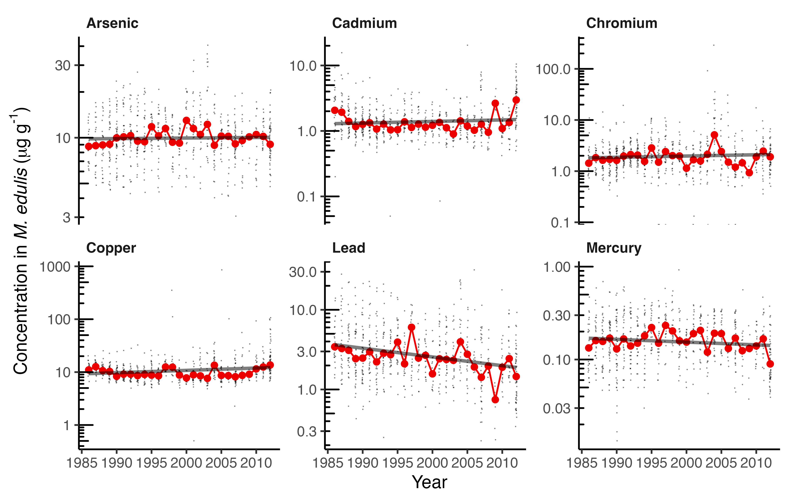

layout: true
  
<div class="my-footer"><span>Qiao-Guo Tan/CEE/XMU | tanqg@xmu.edu.cn | 2025-Mar-12   
&emsp;&emsp;&emsp;&emsp;&emsp;&emsp;&emsp;&emsp;&emsp;&emsp;&emsp;&emsp;&emsp;
&emsp;&emsp;&emsp;&emsp;&emsp;&emsp;&emsp;&emsp;&emsp;&emsp;&emsp;&emsp;&emsp;
</span></div> 


---
## 数据整理
* 2个常用的程序包`dplyr`，`tidyr`
* 都包含在`tidyverse`包中


Package     | 常用函数
------------|--------------------------------------------
`dplyr`     | `select()`，`filter()`，`mutate()`，`arrange()`
            |`group_by()`，`summarise()`
            | `join()`，`%>%`（pipe运算符）
`tidyr`     | `pivot_longer`，`pivot_wider()`


???
## `dplyr`名字的含义

https://github.com/tidyverse/dplyr/issues/1857

hadley commented on 26 May 2016
- The d is for dataframes, the plyr is to evoke pliers. Pronounce however you like.

@kartiksubbarao
- kartiksubbarao commented on 30 Oct 2017
The precursor to dplyr was called plyr. The 'ply' in plyr comes from an expansion/refining of the various "apply" functions in R as part of the "split-apply-combine" model/strategy. Here's a good slideset that provides more insight into the plyr name:

https://www.slideshare.net/hadley/plyr-one-data-analytic-strategy


---

## `tidyverse`包括以下程序包


```{r echo=T, message=F, warning=F}
library(tidyverse)
tidyverse_packages()
```

---
## 认识pipe运算符  

  

.pull-left[
* `dplyr`包中的pipe：.red[`%>%`]
* 新版R自带的pipe：.red[`|>`]  

* 插入pipe的快捷键： 

Windows & Linux	| Mac
-------|---------
Ctrl+Shift+M	| Cmd+Shift+M
]


.pull-right[

```{r echo=F, warning=F, message=F}

```
]


---

## 案例分析：美国贻贝观察

### NOAA's National Status and Trends###    
> NS&T is comprised of three nationwide programs, Benthic Surveillance, .red[Mussel Watch] and Bioeffects that are designed to describe the current status of, and detect changes in, the environmental quality of our nation's .red[estuarine and coastal waters] through environmental monitoring, assessment and related research.

.footnote[
[数据来源：https://products.coastalscience.noaa.gov/collections/ltmonitoring/nsandt/](https://products.coastalscience.noaa.gov/collections/ltmonitoring/nsandt/)  
[数据下载：https://pan.baidu.com/s/1neR-ndGZBBMGEexckrsvJA?pwd=3vjf](https://pan.baidu.com/s/1neR-ndGZBBMGEexckrsvJA?pwd=3vjf)
]


---

### 初步了解数据

* 已从NOAA网站下载数据，将其命名为.red[`MusselWatch20170718.csv`]  

* 读取数据  

```{r}
d0 <- read.csv("MusselWatch20170718.csv") 
```

### 多少行，多少列?
```{r}
dim(d0) #有127743行，用excel处理会很棘手
```

---

### 各列的名称是什么？  
```{r}
names(d0) 
```

### 有哪些年份？  

```{r}
unique(d0$Fiscal_Year)
```

---

### 测定了哪些类型的样品？  

```{r}
unique(d0$Matrix)

```

---
### 各类样品各有多少个？
```{r}
table(d0$Matrix)
```

---

### 测定了哪些污染物？  

```{r}
unique(d0$Parameter)
```

---

### 数据的单位是什么？  

```{r}
unique(d0$Unit)
```

* 注意：有两种单位，后续分析时需小心，不能把不同单位的数据混在一起分析

---
## 提出问题

### 1. 牡蛎和贻贝，哪类生物的Zn浓度高？
### 2. 牡蛎、贻贝中各种金属的年际变化趋势？
### 3. Zn浓度高的牡蛎，是否Cu浓度也高？
<br>

--

### 目前的数据存在哪些问题：
1. 数据太大，冗余信息过多

--

2. 存在干重、湿重两种不同的单位

---

## 整理数据：用`select()`筛选数据的特定列

### 使用“列名”来选择列 

- .large[选择数据`d0`的`Fiscal_Year`,  `Matrix`,  `Scientific_Name`,  `Parameter`, `Value`, `Unit`列，存入`d`  ]
```{r message=FALSE, warning=FALSE}
library(tidyverse)
d <- d0 %>%
  select(Fiscal_Year, Matrix, Scientific_Name, Parameter, Value, Unit) #<<
```


- .large[检查一下结果是否符合预期：]

```{r}
names(d)
```

---

### 也可以用“列号”进行选择  

- .large[选择数据`d0`的第8， 10， 14， 16列，存入`d1`]  

```{r}
d1 <- d0 %>%
   select(8, 10, 14, 16) #<<
names(d1)
```


- .large[删去数据`d0`的第1-7列，第9，15列，存入`d2`]  

```{r}
d2 <- d0 %>%
  select(-c(1:7, 9, 15)) #<<
names(d2)
```

---

## 数据整理： 用`filter()`筛选数据的特定行  

### 筛选出牡蛎和贻贝Zn的数据

```{r }
d_Zn <- d0 |> 
  select(Fiscal_Year, Matrix, Scientific_Name, Parameter, Value, Unit) |> 
  filter(Matrix %in% c("Oyster", "Mussel")) |> #<<
  filter(Parameter == "Zinc") #<<
```

<br>

.large[注意：筛选多个目标值用".red[`%in%`]"，筛选单一目标值用".red[`==`]"。]  

等价于：

```r
d_Zn <- d0 |> 
  select(Fiscal_Year, Matrix, Scientific_Name, Parameter, Value, Unit) |> 
  filter((Matrix == "Oyster" | Matrix == "Mussel") & Parameter == "Zinc" )
```


---

### 检查一下新的数据

```{r }
dim(d_Zn)  #行数大为精简
```


### 再次查看数据的单位  
```{r highlight.output=1}
unique(d_Zn$Unit)
```

.large[数据全部是基于干重的了，可以解除警报 ]

---
### 检查数据  
```{r highlight.output=1}
unique(d_Zn$Matrix)  #只剩下Oyster和Mussel

unique(d_Zn$Parameter) #只剩下Zinc
```


```{r }
unique(d_Zn$Scientific_Name) # 发现牡蛎、贻贝共有7个物种，我们可以把问题1细化到物种
```
---
### 查看各物种有多少条数据：
```{r}
table(d_Zn$Scientific_Name)
```

### 删除只有两条数据的物种
```{r}
d_Zn <- d_Zn |> 
  filter(Scientific_Name != "Crassostrea gigas")
```


---

### 也可以用base R的`subset()`筛选数据

- 例如，筛选牡蛎数据的代码如下：  

```{r}
d_oy <- subset(d, Matrix=="Oyster") 
unique(d_oy$Matrix)
```

<br>

此操作简洁快速，适用于筛选步骤不多的场合

---
## 注意区分`filter()`和`select()` 

- .large[`filter()` 用于选择特定的行（即样品、观察)]

- .large[`select()` 用于选择特定的列（即变量) ]


---
### 研究问题1：牡蛎、贻贝，谁的Zn浓度高？


.pull-left[

- 作散点图  

```r
d_Zn %>% 
  ggplot(aes(Scientific_Name, Value) )+
  geom_point()
```
]

.pull-right[
```{r echo=F, warning=F, message=F}
library(knitr)

# ggsave("pics/mussel_1.png", width = 3106/600, height = 2180/600, dpi = 600)


```
]


---

###修改成对数坐标###


.pull-left[

当数据之间差异很大时，可以考虑用对数坐标，使数据均匀分散开  

```r
d_Zn %>% 
  ggplot(aes(Scientific_Name, Value, color = Matrix))+
  geom_point()+
*  scale_y_log10() 
```
]

.pull-right[

```{r echo=F, warning=F, message=F}

# ggsave("pics/mussel_2.png", width = 3106/600, height = 2180/600, dpi = 600)  

  
```
]

---

### 物种名称太长，放到y轴上

.pull-left[
```r
d_Zn |> 
  ggplot(aes(x = Value,
             y = Scientific_Name,
             color = Matrix)) +
  geom_point() +
  scale_x_log10()
```
]

.pull-right[
```{r echo=F, warning=F, message=F}

# ggsave("pics/mussel_3.png", width = 550/90, height = 290/90, dpi = 600)


  
```
]


---
### 按中位值排序  


.pull-left[

原先的顺序无规律，不便于传达信息  

```r
d_Zn %>% 
 ggplot(aes(x = Value, 
* y = reorder(Scientific_Name, Value, median),
  color = Matrix))+ #按中位值降序排序
  geom_point()+
  scale_x_log10()

```
]

.pull-right[
```{r echo=F, warning=F, message=F}


# ggsave("pics/mussel_5.png", width = 550/90, height = 290/90, dpi = 600)

```
]

--

- 用到了`reorder()`函数按照中位数降序排列  
- 你可以`?reorder()`看看这个函数的用法
- 思考：按照均值升序如何排列？

---
### 手动排序  

- 从图上观察高低顺序，然后按顺序排列
- 这种方法容易理解，很常用  
- 代码如下：  

```{r}
# 注意重排序的物种名存入新变量Scientific_Name_2，以避免覆盖原变量
d_Zn$Scientific_Name_2 <- factor(
  d_Zn$Scientific_Name,
  levels = c(
    "Geukensia demissa",
    "Mytilus edulis",
    "Mytilus species",
    "Ostrea sandvicensis",
    "Crassostrea virginica",
    "Crassostrea rhizophorae"
  )
)
```

---
### 按中位值排序-2  
.pull-left[
```r
d_Zn %>%
*  ggplot(aes(x = Value, y = Scientific_Name_2,
             color = Matrix)) +
  geom_point() +
  scale_x_log10()
```
]


.pull-right[
```{r echo=F, warning=F, message=F}

# ggsave("pics/mussel_5b.png", width = 550/90, height = 290/90, dpi = 600)

```
]
---
### 修饰细节  
- 数据点较多时，可以用小提琴图展现数据的分布，用抖动点充分展现原始数据
- 颜色的使用考虑色盲读者，考虑黑白打印     

```r
d_Zn %>%
  ggplot(aes(Value, reorder(Scientific_Name, Value, median), color = Matrix)) +
  theme_classic()+
* geom_violin(draw_quantiles = 0.5, key_glyph = draw_key_blank)+ #小提琴图，不画图例
  geom_point(size = 0, alpha = 0.5,
    position = position_jitter(width = 0, height = 0.2)) +
  scale_x_log10()+
  annotation_logticks(sides="b")  + #对数刻度 
* ggsci::scale_color_aaas()+ #程序包配色
  labs(x=~"Zn concentration ("*mu*g~g^'-1'*"dry wt.)",
       y=NULL, color = NULL)+
  guides(colour = guide_legend(override.aes = list(size = 2, alpha = 1)))+ #修改图例格式
  theme(axis.text.y = element_text(face="italic"))+ #物种名斜体
  theme(legend.position=c(0,1),
        legend.justification = c(0,1),
        legend.background = element_blank(),
        legend.key = element_blank()) #调整图例位置、背景
```
---
class: center 
### 成品
```{r echo=F, warning=F, message=F, out.width="70%"}

# ggsave("pics/mussel_6.png", width = 528/90, height = 304/90, dpi = 600)

```

---

## 用`group_by`和`summarise`分组计算均值、标准差  


- 按物种名（`Scientific_Name`）分组  
- 计算各组浓度（`Value`）的均值（`mean`）和标准差（`sd`）
```{r warning=FALSE, message=FALSE}
d_Zn_mean <-  d_Zn %>%
  group_by(Matrix, Scientific_Name) |>  #<<
  summarise(mean = mean(Value), sd = sd(Value), sample_size = n()) #<<

```


- 查看计算结果 

```{r}
d_Zn_mean

```

- 以上结果可用于作图，也可用于表格  


---

### 研究问题2：紫贻贝（*Mytilus edulis*）中各种金属的年际变化趋势？


- 再来观察数据

```{r}
unique(d0$Parameter)
```

---
### 铅污染的年际变化趋势

* 筛选出*Mytilus edulis*的铅浓度数据  
* 求中位值，作图，添加拟合线      

.pull-left[
```r
d0 %>% 
filter(Scientific_Name=="Mytilus edulis") |> 
  filter(Parameter == "Lead") |>  
  group_by(Fiscal_Year) |> 
  summarise(median = median(Value)) |> 
  ggplot(aes(Fiscal_Year, median)) +
  geom_point() +
  scale_y_log10() +
  geom_smooth() +
  labs(title="Pb")
```
]

.pull-right[
```{r echo=F, warning=F, message=F}

# ggsave("pics/mussel_7.png", width = 310/90, height = 243/90, dpi = 600)

```
]


---
### 一并查看多种金属污染物的年际变化趋势

选择重要的金属污染物
```{r}
metal <- c("Arsenic", "Cadmium", "Chromium", "Copper", "Lead", "Mercury")
d_trend <- d0 |> 
  filter(Scientific_Name =="Mytilus edulis") |> 
  filter(Parameter %in% metal) |> 
  select(Fiscal_Year, Scientific_Name, Parameter, Value)
head(d_trend)
```

---
### 一并查看多种金属污染物的年际变化趋势
```r
d_trend |> 
  ggplot(aes(Fiscal_Year, Value))+
  geom_point()+
  geom_smooth(se = F)+
  facet_wrap(~Parameter)+
  scale_y_log10()
```

---
### 一并查看多种金属污染物的年际变化趋势
```{r echo=F, warning=F, message=F, out.width="70%"}


# ggsave("pics/mussel_8.png", width = 605/90, height = 385/90, dpi = 600)

```

---
### 多种金属污染物的年际变化趋势：细节修改
```r
d_trend |> 
  ggplot(aes(Fiscal_Year, Value))+
  theme_classic()+
geom_point(shape=".", position=position_jitter(width=0.1), alpha=0.5)+
  stat_summary(geom="line", fun = "median", color="red2")+
  stat_summary(geom="point", fun = "median", color="red2")+
  facet_wrap(~Parameter, scales="free_y")+
  geom_line(stat="smooth", method="lm", se = F, alpha=0.5, size = 1)+
  scale_y_log10()+
  theme(strip.background = element_blank(),
        strip.text = element_text(hjust = 0, face ="bold"))+
  annotation_logticks(sides = "l")+
  labs(x = "Year", y = ~"Concentration in"~italic("M. edulis")~"("*mu*g~"g"^"-1"*")" )
```

---
### 多种金属污染物的年际变化趋势：细节修改
```{r echo=F, warning=F, message=F, out.width="70%"}

# ggsave("pics/mussel_9.png", width = 605/90, height = 385/90, dpi = 600)

```


---
### 研究问题3：Zn浓度高的牡蛎，是否Cu浓度也高？

以牡蛎*Crassostrea virginica*为例  

---
### 方法1：用`pivot_wider()`来整理数据

筛选出牡蛎 (*Crassostrea virginica*)的Cu, Zn数据

```{r}
d_CuZn <- d0 %>% 
  filter(Scientific_Name=="Crassostrea virginica") |> 
  filter(Parameter %in% c("Copper","Zinc")) |> 
  select(Sample_ID, Fiscal_Year, Scientific_Name, Parameter, Value)
 
head(d_CuZn) 
```

---
### 把长表格转化为宽表格
Cu、Zn数据原本在同一列，现分为两列  
```{r}
d_CuZn_wide <- d_CuZn |> 
  pivot_wider(names_from = Parameter, 
              values_from = Value) #<<
head(d_CuZn_wide)

```

---
### 作图  
.pull-left[
```{r
d_CuZn_wide |> 
 ggplot(aes(Copper, Zinc))+
  geom_point(size=0.2, alpha=0.5)+
  scale_x_log10()+
  scale_y_log10()
```
]

.pull-right[

```{r echo=F, warning=F, message=F}


# ggsave("pics/mussel_10.png", width = 310/90, height = 255/90, dpi = 600)

```


]


---
### 分年份作图
```r
d_CuZn_wide |> 
 ggplot(aes(Copper, Zinc))+
  geom_point(size=0.2, alpha=0.5)+

  facet_wrap(~Fiscal_Year)+
  scale_x_log10()+
  scale_y_log10()+
  geom_smooth(method="lm")
```


---
### 分年份作图
```{r echo=F, warning=F, message=F, out.width="72%"}

# ggsave("pics/mussel_11.png", width = 651/90, height = 440/90, dpi = 600)

```

---
### 方法2：用`inner_join()`，`left_join()`来合并数据   

.pull-left[
* 筛选出Copper的数据

```{r}
d_Cu <- d_CuZn  %>% 
  filter(Parameter=="Copper") %>% 
  rename(Cu = Value) # 重命名
dim(d_Cu) # 1655行
```
]


.pull-right[

* 筛选出Zinc的数据
```{r}
d_Zn <- d_CuZn %>% 
  filter(Parameter=="Zinc") %>% 
  rename(Zn=Value)
dim(d_Zn) # 1655行
```
]

* 两种金属的数据都是1655条，很可能一一对应  
* 这需要一一核对两组数据的`Sample_ID`才能确定，工作量很大  
* `join`系列函数就派上用场了  


---
### 用`left_join()`合并两个表格  

```{r}
d_CuZn_wide2 <- d_Cu |>  
  left_join(d_Zn, by = "Sample_ID") #当两组数据的Sample_ID相同时，则合并在同一行

dim(d_CuZn_wide2) # 还是1655列，1个也没丢失，说明两组数据确实一一对应
names(d_CuZn_wide2)
```

---

### `join`系列函数  


- `inner_join()`  
return all rows from x where there are matching values in y, and all columns from x and y. If there are multiple matches between x and y, all combination of the matches are returned.    
<br>
- `left_join()`  
return all rows from x, and all columns from x and y. Rows in x with no match in y will have NA values in the new columns. If there are multiple matches between x and y, all combinations of the matches are returned.  
<br>
- `right_join()`  
return all rows from y, and all columns from x and y. Rows in y with no match in x will have NA values in the new columns. If there are multiple matches between x and y, all combinations of the matches are returned.  
<br>
- `full_join()`  
return all rows and all columns from both x and y. Where there are not matching values, returns NA for the one missing.  
<br>
阅读： https://dplyr.tidyverse.org/reference/join.html

---

### 作散点图

.pull-left[
```r
d_CuZn_wide2|> 
ggplot(aes(Cu, Zn))+
  geom_point()+
  scale_x_log10()+
  scale_y_log10()+
  geom_smooth(method="lm")

```
]


.pull-right[

```{r echo=F, warning=F, message=F}

# ggsave("pics/mussel_12.png", width = 289/90, height = 226/90, dpi = 600)

```
]


---
## 要点小结

函数 | 功能
-----------|-----------------
`fliter()`  | 根据其值筛选行
`select()`  | 根据其名筛选列
`arrange()` | 改变行的排序，从低到高排
`arrange(desc())`| … 从高到低排
`mutate()`  | 基于现有变量进行计算，增加新的变量（类比excel里的C1=A1*B1)
`summarize()`  | 计算统计量（如均值、方差、中位数）
`pivot_longer()` | 宽表格变长表格
`pivot_wider()` | 长表格变宽表格
`left_join()` |合并数据，保留左侧全部的，右侧没有对应值的则填充NA
`inner_join()` |合并数据，保留共有的
...      | ....


---

## 要点小结

### pipe运算符：.red[`%>%`]或.red[`|>`]    

- 翻译成管道，可读作"然后"
- pipe将多个操作串联起来，上一操作的结果成为下一操作的对象  
- 功能类似`ggplot`里的"`+`"号  


---

## 阅读：

1. Overview of dplyr. https://dplyr.tidyverse.org/index.html  
<br>  
2. Introduction to dplyr. https://dplyr.tidyverse.org/articles/dplyr.html  
<br>  
3. Hadley Wickham, Mine Çetinkaya-Rundel, Garrett Grolemund. R for Data Science (2e): Chapter 4. Data transformation. https://r4ds.hadley.nz/data-transform.html  
<br>  
4. Hadley Wickham, Mine Çetinkaya-Rundel, Garrett Grolemund. R for Data Science (2e): Chapter 6. Data tidying. https://r4ds.hadley.nz/data-tidy.html
